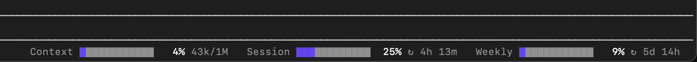
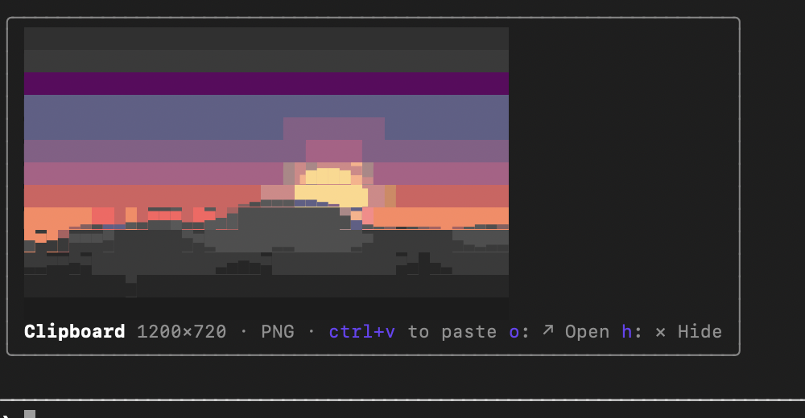

# claude-code-plugins

Personal [Claude Code mods](https://code.claude.com/docs/en/plugins/mods/overview): small HUD tweaks for the terminal, packaged as one plugin marketplace named `lenadweb-mods`.

| Mod | What it does |
| --- | --- |
| **[usage-meter](plugins/usage-meter)** | Progress bars at the bottom right of the prompt footer, as in the desktop app: **context** window fill, **session** (5-hour) and **weekly** plan limits with time until reset. Bars are blue, turn amber past 70% and red past 90%. |
| **[image-preview](plugins/image-preview)** | When the clipboard holds an image, shows its preview above the prompt with its size and format. After you paste, each `[Image #N]` in the draft gets a thumbnail until you send the prompt. **↗ Open** opens the image in Preview. Previews size themselves to the terminal. Ghostty and kitty get the real pixels; other terminals, Terminal.app included, get block characters picked per cell from quadrants, halves and eighths. If [chafa](https://hpjansson.org/chafa/) is installed, it draws them instead. |

### usage-meter



### image-preview



Each mod is a standalone plugin under [`plugins/`](plugins) and can be installed on its own.

## Install

Requires Claude Code 2.1.287 or later.

```sh
claude plugin marketplace add lenadweb/claude-code-plugins
claude plugin install usage-meter@lenadweb-mods
claude plugin install image-preview@lenadweb-mods
```

Then run `/reload-plugins` in an open session, or restart Claude Code.

## Notes

- **usage-meter**: session and weekly limits appear after the first reply of a session (Claude Code learns them from API responses) and only on a Pro or Max subscription. The context bar is there from the start.
- **image-preview**: macOS only (reads the clipboard with `osascript` and scales with `sips`, both built in). With the band above the prompt focused (click it, or ctrl+x tab): `o` opens the clipboard image, `1`–`9` open a pasted one, `h` hides the preview until the clipboard changes.

## Develop

Load a mod straight from the working tree; edits hot-reload while the session runs:

```sh
claude --plugin-dir plugins/usage-meter --plugin-dir plugins/image-preview
```

Check a mod before committing:

```sh
claude plugin validate .
claude plugin validate plugins/usage-meter
claude plugin validate plugins/image-preview
```

To add a mod, create `plugins/<name>/` with `.claude-plugin/plugin.json`, `hooks/hooks.json` and `hooks/register.tsx`, then list it in [`.claude-plugin/marketplace.json`](.claude-plugin/marketplace.json).

## License

[MIT](LICENSE)
