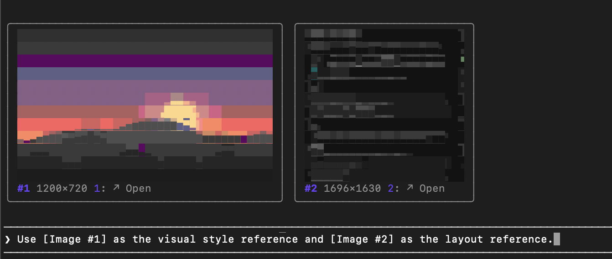

# lenadweb-image-preview

See the image you are about to paste into Claude Code before you paste it. When the clipboard holds an image, lenadweb-image-preview draws a preview above the prompt with its size and format. After you paste, every `[Image #N]` in your draft gets a thumbnail until you send the prompt, so you always know which image is which.

## Features

- A preview of the clipboard image, sized to the terminal window.
- Thumbnails of the images pasted into the draft, numbered like the `[Image #N]` tags.
- **↗ Open** opens the full image in the default viewer, such as Preview.
- **✕ Hide** hides the preview until the clipboard changes.
- With the band above the prompt focused (click it, or press ctrl+x then tab): `o` opens the clipboard image, `1` to `9` open a pasted image, and `h` hides the preview.

Ghostty and kitty show the real pixels through the kitty graphics protocol. Other terminals, Terminal.app included, show the image drawn with block characters, choosing for each cell the shape and two colours that match it best. If [chafa](https://hpjansson.org/chafa/) is installed, it draws the block characters instead.

## Requirements

- macOS, because the plugin reads the clipboard through the system pasteboard.
- Claude Code 2.1.287 or later, in a terminal. The plugin is a mod: it only draws inside the Claude Code terminal and does nothing in chat, Cowork or the desktop app, which has image previews of its own.

## What it runs and reads

Everything happens on your Mac. The plugin makes no network requests and sends nothing anywhere.

- **The clipboard**: every 1.5 seconds it runs `osascript` to check whether the clipboard changed and holds an image. Only when it does, the image is saved to a private temporary folder made with `mktemp`.
- **`sips`**, built into macOS, converts the image to PNG and scales it down for drawing.
- **`chafa`**, only if it is already installed, draws the block characters.
- **`open`** runs only when you press **↗ Open**, to show the image in your default viewer.
- **The prompt draft** is read to find `[Image #N]` tags. Its text is not stored or sent.
- **Environment variables** `TERM_PROGRAM`, `TERM`, `COLORTERM` and `KITTY_WINDOW_ID` are read to tell which terminal you use.

The temporary folder, with every image saved in it, is deleted when the Claude Code session ends.

## License

MIT
